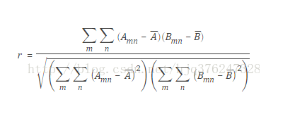
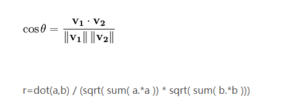

##### 学生代码作业重复度检测算法构思——基于矩阵角度

**摘要**：由于学生作业代码结构以及内容相对来说比较简单，很多的复杂算法一定程度上不太适用于此类检测。如何很好的检测学生作业重复情况，如何精准检测，就是能够提取出学生作业代码足够的特征信息。利用矩阵来还原学生作业代码，对不同学生代码生成的矩阵进行一系列的重复度检测。矩阵能够很好的直观上还原出学生的代码形状包含全部代码位置信息，在预处理上大大优化了代码特征信息丢失的情况，并且矩阵算法丰富，矩阵相似度计算成熟，对于相似度的计算又可以做到进一步的精准度优化。
**关键字**：代码结构，特征信息，还原，矩阵算法，精准度

##### **一、引言**

由于学生作业代码结构以及内容相对来说比较简单，很多的复杂算法一定程度上不太适用于此类检测，因为大部分的代码检测系统会对源代码进行一系列的处理，而大多数学生作业代码在经过处理后，会造成作业代码原始信息大量丢失，导致最后检测的重复度普遍偏高，作业重复度检测欠缺一定的精确度。

如何很好的检测学生作业重复情况，如何精准检测，就是能够提取出学生作业代码足够的特征信息。人眼观察加上大脑判断能够对大多数数据量小的学生作业代码，做出较为精准的代码特征信息提取和比较。

计算机要替代人眼和人脑对不同数据量代码进行大批量的检测，最好的情况，就是计算机处理的数据尽可能还原学生作业的实际作业内容。我们想到了利用矩阵来还原学生作业代码，对不同学生代码生成的矩阵进行一系列的重复度检测。矩阵能够很好的直观上还原出学生的代码形状包含全部代码位置信息，在预处理上大大优化了代码特征信息丢失的情况，并且矩阵算法丰富，矩阵相似度计算成熟，对于相似度的计算又可以做到进一步的精准度优化。

之前基于winnowing算法的代码检测，将学生代码中的变量名，函数名，字符串分别用统一符号替换掉，可以理解为主要检测代码结构的重复度。
例如，如下为一段代码：
 ``` 
 import os
import numpy as np
import pandas as pd
import shutil

def show_list(k,t,path1):              
    c = ['A','B','C','D','E','F','G','H','I','J','K','L','M','N']
    copy_students = []        
                ###根据重复度挑选出相关同学
                if h == 1:
                    if result.index[i] not in copy_students:
                        copy_students.append(result.index[i])
if __name__ == '__main__':    
    main()
```
经过 cleanUP.py 处理为：
```
'importosimportnumpyasnpimportpandasaspdimportshutildefF(N,N,N):N[SSS,SSS,SSS,SSS,SSS,SSS,SSS,SSS,SSS,SSS,SSS,SSS,SSS,SSS]N[]ifN==1:ifN.N[N]notinN:N.append(N.N[N])if__name__==SSS:main()'
```
因此，我们对于学生代码作业的处理更多的是提取对代码整体结构，再进行检测。这样的处理主要针对代码结构进行检测，一定程度是非常合理的。因为对于学生作业来说，代码的结构相似度更能反映代码的重复度。

##### **二、新的想法**

在原有的基础上提出利用矩阵来还原学生作业代码。通俗来说，将每个学生的代码作业看成一个大矩阵，能够最大化还原学生作业实际样貌。

学生代码作业抄袭情况，广义上理解为三种类型（代码结构明显不同基本不存在抄袭）：
1. 代码结构重复度低，具体代码内容重复度低----------最终重复度低，可判定没有抄袭
2. 代码结构重复高，具体代码内容重复度a%----------可得出最终重复度，有一定的抄袭嫌疑或部分抄袭
3. 代码结构重复度高，具体代码内容重复度高----------最终重复度高，可判定抄袭

######  **2.1、生成作业矩阵**
利用`
pygments.token
pygments.lexers
`方法处理按行处理原始作业,去掉注释等多余信息，但不用特殊字符替代变量、函数名等，保留原始代码内容。
例如，代码的第i行为：
```
if （a == 3） and （b == 2）：
```
处理后第i行为：
```
['if','(','a','=','=','3',')','and','(','b','=','=','2',')']
```
将各字符的生成的hash值取代原来的作业代码。
例如;
[23,1422,213,123,121,676,32,23,121]
（生成一个足够大的零矩阵，能够学生代码信息全部添加进这个矩阵）
也可以将学生作业转换为n行m列的一个矩阵，其中n为这个学生的代码行数，m为这个学生字符个数最多的一行的字符数，字符不够m的行的空补0。
例如：
【
123 816 727 55 0 0 0 0
162 62 334 0 0 0 0 0
……
276 66 77 88 44 0 0 0
】
由于矩阵性质，很好的将作业的原始代码的样貌，代码位置信息保存下来了。
######  **2.2、作业矩阵信息分析**
例如一个学生代码矩阵 S~1~ 为：
【
123 816 727 55 0 0 0 0
162 62 334 0 0 0 0 0
……
276 66 77 88 44 0 0 0
】
我们可以得到每行不为0的列数的信息：S~1~ = (4,3,7,6,4,2,4,8,5)。
一个学生作业矩阵包含的信息：
1. hash值矩阵数据；
2. 不全为0的行的列数，可反映代码形状

列数可生成k-grams序列，例如GS~1~ = (437,376,764,642,424,248,485)，k=3.
返回grams序列相同的元素的index

######  **2.3、重复度检测**


常用的矩阵相似度度量方法：
运算量太大：


r在[0,1]内，越接近1越相关
当A或B内部所有元素全部一样分母为0，结果为NAN。



r在[-1,1]内，越接近1越相关


考虑使用的作业矩阵相似度度量方法：
1.各行的列数信息，可以反映出学生代码的形状。可以作为比较的数据。

2.学生矩阵相同位置元素相减，数新产生的0元素个数，和原来元素个数相比，可得出重复率，并通过一行相减都为0锁定行的位置信息，进而锁定具体代码重复的位置生成的学生作业矩阵的初始0元素。

问题：相同的作业多一行或者少一行，都会改变结果。可能矩阵内容相似，但是位置岔开了，包括拼接位置的改变会改变想减完的数据

3.在第2步的基础上优化，把相同位置元素相减优化，考虑每三行求一次交集等。


